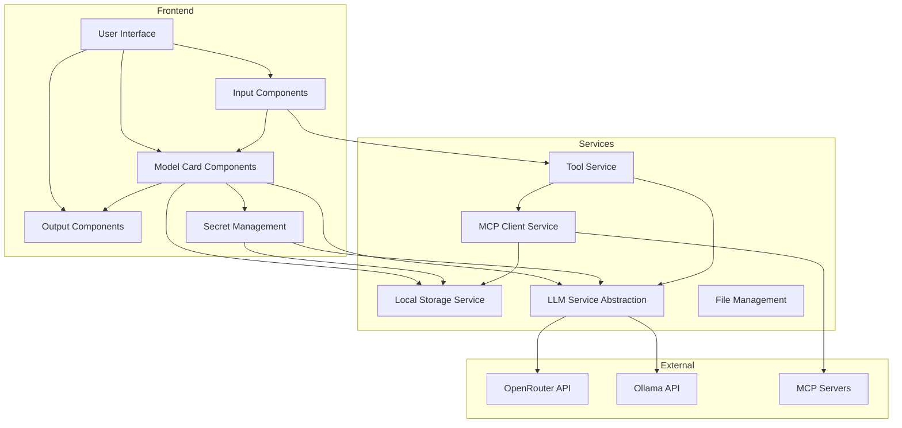

# Revised Architecture for Model Card Application

## System Architecture



## Core Components (Updated)

### 1. Model Card Component
- React component with editable parameters
- Ability to connect to other model cards or output components
- Integration with LLM service
- Parameter configuration UI
- Model capability validation for file, image, tools, audio support
- **System prompt configuration**
- **Settings JSON configuration**
- **MCP server selection**

### 2. Input Component
- Text input (rich text editor)
- File upload (images, documents)
- Audio recording/upload
- Input validation and preprocessing
- Tool integration from MCP or other sources
- Tool selection and configuration UI
- **Connection to model cards or workflows**

### 3. Output Component
- Text/Markdown rendering
- Copy functionality
- Export options (text, markdown, PDF)
- Formatting options
- Tool usage responses display
- Usage statistics visualization
- **Display of model card or workflow outputs**

### 4. LLM Service
- Abstraction layer for LLM providers
- API key management
- Request/response handling
- Error handling and retry logic
- Specific integration with:
  - OpenRouter for cloud LLM services
  - Ollama for local models
- **System prompt handling**

### 5. Storage Service
- Client-side storage for conversation history
- Model card configurations
- User preferences
- Logs and analytics
- Adaptable design for future local database integration
- MCP server settings storage
- **Storage of enabled/disabled status for MCP servers**

### 6. Tool Service
- Integration with MCP tools
- Tool execution and response handling
- Tool capability validation
- Tool usage logging

### 7. MCP Client Service
- Add/remove/update MCP servers
- Act as MCP Client to call MCP Servers
- Persist MCP server settings
- **Enable/disable MCP servers at server level**
- Store MCP settings as JSON in LocalStorage
- MCP server discovery and connection management

### 8. Workflow Management
- Connect model cards
- Data flow between components
- Simple pipeline creation
- **Integration with input and output components**

## Data Models (Updated)

### Model Card
```typescript
interface ModelCard {
  id: string;
  name: string;
  description: string;
  systemPrompt: string; // New field
  parameters: Parameter[];
  inputConnections: Connection[];
  outputConnections: Connection[];
  llmProvider: 'openrouter' | 'ollama';
  llmModel: string;
  capabilities: ModelCapabilities;
  mcpServers?: string[]; // IDs of connected MCP servers
  settings?: Record<string, any>; // New field
  createdAt: Date;
  updatedAt: Date;
}
```

### MCP Server
```typescript
interface MCPServer {
  id: string;
  name: string;
  settings: Record<string, any>;
  enabled: boolean; // New field
  createdAt: Date;
  updatedAt: Date;
}
```

## UI Flow (Updated)

1. **Home Page**:
   - Display input component that can connect to model cards or workflows
   - Show output component for displaying results
   - Provide quick actions for common tasks

2. **Model Card Management**:
   - List existing model cards
   - Create new model cards with system prompts and settings
   - Edit model cards with all configuration options
   - Connect model cards to MCP servers

3. **MCP Server Management**:
   - List existing MCP servers
   - Add/edit MCP servers with settings
   - Enable/disable MCP servers
   - Test MCP server connections

4. **Workflow Management**:
   - Create workflows by connecting model cards
   - Configure workflow execution
   - Test workflows with input component
   - View results in output component

## Theme Management (Fixed)

- Properly apply dark mode to the html element
- Persist theme preference in local storage
- Provide theme toggle in UI
- Support system preference detection

This revised architecture addresses all the requirements specified in FIXIT-mock-1.md while maintaining the core functionality of the application.