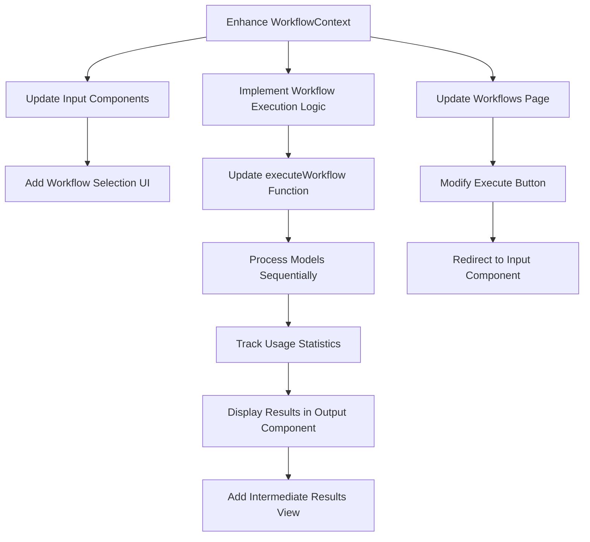
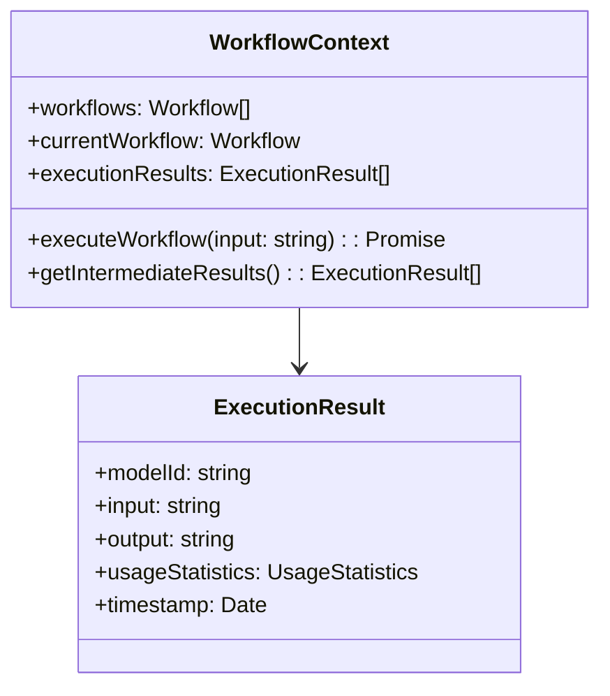
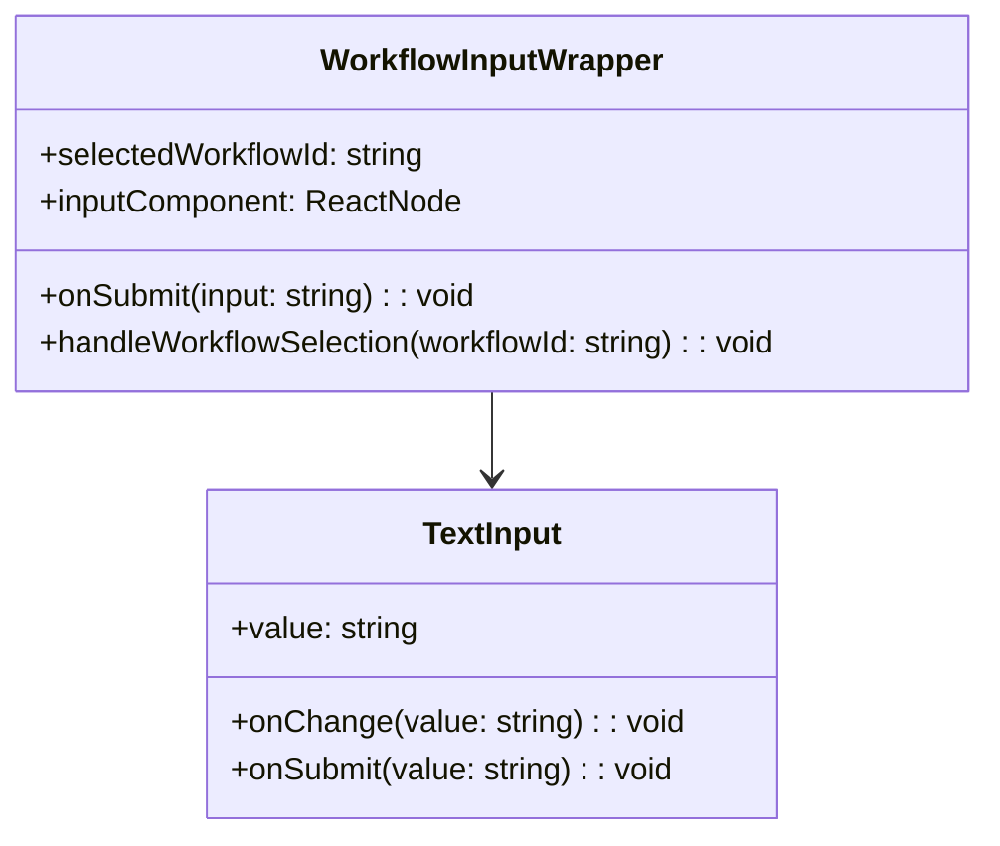
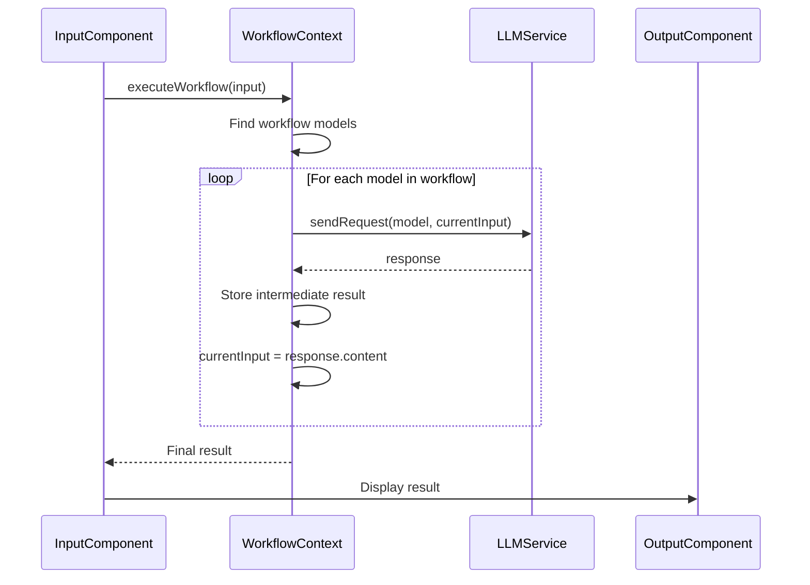
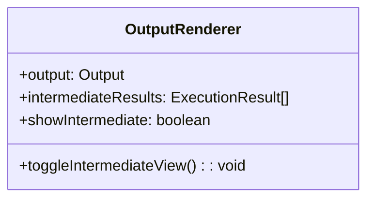

# Workflow Execution Implementation Plan

## Current State Analysis

After reviewing the codebase, I've identified the following:

1. The application has a workflow system that allows defining workflows consisting of one or more model cards in an ordered list.
2. The current implementation helps define workflows but does not execute them.
3. The `WorkflowContext.tsx` has a placeholder `executeWorkflow` function that doesn't actually process the workflow through the models.
4. Input components (TextInput, AudioInput, FileInput) exist but don't have workflow selection functionality.
5. The workflow execution should be triggered from input components or via the "Execute" button in the `/workflows` route.

## Requirements for Implementation

Based on the WORKFLOW.md file and clarifications, we need to implement:

1. **Input Component Enhancement**:
   - Add a dropdown to select which workflow to use
   - Use the existing Submit button to trigger workflow execution

2. **Workflow Execution**:
   - Take input from the input component
   - Process the input through the first model in the workflow
   - Pass each model's output directly as input to the next model
   - Render the final output in the output component
   - Store intermediate results for optional viewing

3. **Execute Button in Workflows Page**:
   - Redirect to an input component where the user can provide input

4. **Usage Statistics**:
   - Track and display usage statistics for each individual model in the workflow
   - Also display the total usage statistics for the entire workflow

5. **Results Display**:
   - Show the final output by default
   - Provide an option to view intermediate results

## Detailed Implementation Plan



### 1. Enhance WorkflowContext

First, we need to enhance the `WorkflowContext` to support workflow execution:



### 2. Update Input Components

Create a new wrapper component for input components that adds workflow selection:



### 3. Implement Workflow Execution Logic

The core execution logic in the `executeWorkflow` function:



### 4. Update Output Component

Enhance the output component to display workflow results:



## Specific File Changes

### 1. `app/context/WorkflowContext.tsx`

- Update the `WorkflowContextType` interface to include:
  - `executionResults: ExecutionResult[]`
  - `getIntermediateResults(): ExecutionResult[]`
  - Enhance `executeWorkflow` to return `Promise<ExecutionResult>`

- Implement the `executeWorkflow` function to:
  - Process input through each model in sequence
  - Use the LLM service to send requests to each model
  - Store intermediate results
  - Track usage statistics for each model
  - Return the final result and all statistics

### 2. Create a new component: `app/components/workflow/WorkflowInputWrapper.tsx`

- Create a wrapper component that:
  - Displays a dropdown to select workflows
  - Wraps any input component (TextInput, AudioInput, etc.)
  - Handles workflow selection
  - Passes the input to the selected workflow on submit

### 3. Update `app/pages/Workflows.tsx`

- Modify the `handleExecuteWorkflow` function to:
  - Redirect to a page with an input component
  - Pass the selected workflow ID as a parameter

### 4. Update `app/components/output/OutputRenderer.tsx`

- Enhance to:
  - Display the final output by default
  - Add a toggle button to show/hide intermediate results
  - Display usage statistics for each model and the total

### 5. Create a new component: `app/components/workflow/IntermediateResultsView.tsx`

- Create a component that:
  - Displays intermediate results in a collapsible view
  - Shows input, output, and statistics for each model in the workflow
  - Provides a visual representation of the workflow execution

## Implementation Steps

1. **Step 1**: Enhance the WorkflowContext with execution functionality
2. **Step 2**: Create the WorkflowInputWrapper component
3. **Step 3**: Update the Workflows page to redirect to input component
4. **Step 4**: Enhance the OutputRenderer to display workflow results
5. **Step 5**: Create the IntermediateResultsView component
6. **Step 6**: Test the workflow execution functionality

## New Types Required

```typescript
// Add to app/types/index.ts

export interface ExecutionResult {
  modelId: string;
  modelName: string;
  input: string;
  output: string;
  usageStatistics: UsageStatistics;
  timestamp: Date;
}

export interface WorkflowExecutionResult {
  workflowId: string;
  workflowName: string;
  results: ExecutionResult[];
  finalOutput: string;
  totalUsageStatistics: UsageStatistics;
  startTime: Date;
  endTime: Date;
}